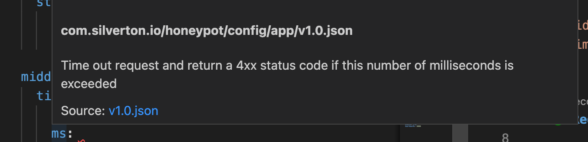
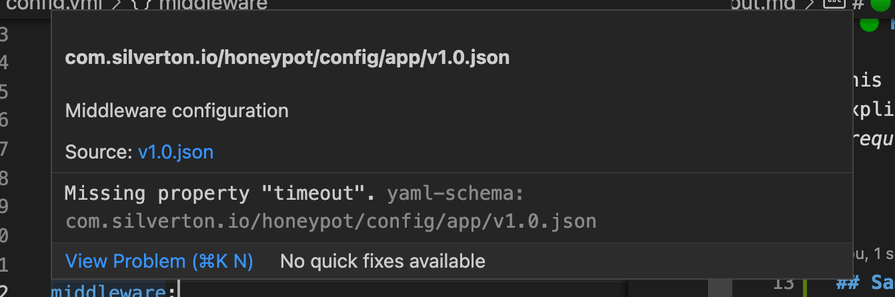

---
tags:
  - middleware
  - timeout
---

# 🟢 Request Timeout

This middleware allows the Honeypot operator to explicitly declare a time threshold, in milliseconds, after which a request times out.

If a request goes longer than the configured threshold a [408](https://developer.mozilla.org/en-US/docs/Web/HTTP/Status/408) is returned.

## Sample Configuration

```
middleware:
  timeout:
    enabled: false
    ms: 2000
```

## Configuration Guidance and Validation

Request timeout middleware configuration is required. The `yaml` [Vscode plugin](https://marketplace.visualstudio.com/items?itemName=redhat.vscode-yaml) will give guidance on appropriate config. It will also assist in autocompletion.




