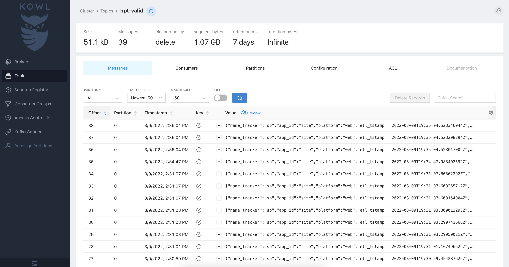

---
tags:
  - getting started
  - redpanda
  - kafka
  - kowl
  - materialize
---

# Event Streaming with 🍯

This quickstart will get you started with Honeypot, a multi-node Redpanda cluster, Kowl, and Materialize for rapidly bootstrapping streaming analytics. It is an end-to-end real-time event collection, pipelining, and aggregation system.

# Quickstart (with Docker)

Note! If you don't have `docker` and `docker-compose`, you will need to install those first.

`psql` is also a nice tool to have if you want to query Materialize.

## 1. Clone the Honeypot repo

**`git clone git@github.com:silverton-io/honeypot.git && cd honeypot`**


```
~/code ❯❯❯ git clone git@github.com:silverton-io/honeypot.git
Cloning into 'honeypot'...
remote: Enumerating objects: 1324, done.
remote: Counting objects: 100% (1324/1324), done.
remote: Compressing objects: 100% (615/615), done.
remote: Total 1324 (delta 611), reused 1163 (delta 495), pack-reused 0
Receiving objects: 100% (1324/1324), 25.89 MiB | 4.35 MiB/s, done.
Resolving deltas: 100% (611/611), done.
~/code ❯❯❯ cd honeypot
```

## 2. Bootstrap Honeypot, Redpanda, Kowl, and Materialize

**`docker-compose -f examples/quickstart/docker-compose.yml up -d`**


```
~/c/honeypot ❯❯❯ docker-compose -f examples/quickstart/docker-compose.yml up -d
...
...
...
 ⠿ Container mzcli          Started                                                                                                        4.3s
 ⠿ Container redpanda-1     Started                                                                                                        4.6s
 ⠿ Container materialized   Started                                                                                                        4.6s
 ⠿ Container redpanda-3     Started                                                                                                        4.4s
 ⠿ Container redpanda-2     Started                                                                                                        4.5s
 ⠿ Container redpanda-init  Started                                                                                                        6.3s
 ⠿ Container kowl           Started                                                                                                        6.4s
 ⠿ Container honeypot       Started                                                                                                        7.1s
~/c/honeypot ❯❯❯
```

## 3. Create Kafka Topics, Materialize Sources and Materialized Views

**`./examples/quickstart/setup.sh`**

```
~/c/honeypot ❯❯❯ ./examples/quickstart/setup.sh
TOPIC        STATUS
hpt-invalid  OK
TOPIC      STATUS
hpt-valid  OK
CREATE SOURCE
CREATE SOURCE
CREATE VIEW
CREATE VIEW
```

## 4. Send Events to Honeypot

The Honeypot quickstart serves a page that you can use to quickly start firing Snowplow events using the [Snowplow Browser Tracker](https://docs.snowplowanalytics.com/docs/collecting-data/collecting-from-own-applications/javascript-trackers/javascript-tracker/javascript-tracker-v3/) here: [localhost:8080](http://localhost:8080/)

The following events are tracked on this page:

  - Page views
  - Page ping (time on page)
  - Forms
  - Redirects
  - Transactions and transaction items
  - Struct events
  - Snowplow self-describing events

using both the `GET` and batch `POST` capabilities of the Snowplow tracker.


## 5. View Events in the Kowl UI

The Quickstart runs Kowl at [localhost:8081](http://localhost:8081).

Incoming events can be viewed in Kowl using the [Topic Viewer](http://localhost:8081/topics/hpt-invalid?o=-1&p=-1&q&s=50#messages).


## 6. Query Real-Time Events using a Streaming Materialized View

Connect to Materialize using `psql`:

**`psql -h 127.0.0.1 -p 6875 -U materialize`**


And select real-time data from the `valid_events` and `invalid_events` materialized views:

```
~/c/honeypot ❯❯❯ psql -h 127.0.0.1 -p 6875 -U materialize

psql (14.1, server 9.5.0)
Type "help" for help.

materialize=> \x
Expanded display is on.
materialize=> select * from valid_events limit 1;
-[ RECORD 1 ]--------------------------------------------------------------------------------------------------------------------------------------------------------------------------------------------------------------------------------------------------------------------------------------------------------------------------------------------------------------------------------------------------------------------------------------------------------------------------------------------------------------------------------------------------------------------------------------------------------------------------------------------------------------------------------------------------------------------------------------------------------------------------------------------------------------------------------------------------------------------------------------------------------------------------------------------------------------------------------------------------------------------------------------------------------------------------------------------------------------------------------------------------------------------------------------------------------------------------------------------------------------------------------------------------------------------------------------------------------------------------------------------------------------------------------------------------------------------------------------------------------------------------------------------------------------------------------------------------------------------------------------------------------------------------------------------------------------------------------------------------------------------------------------------------------------------------------------------------------------------------------------------------------------------------------------------------------------------------------------------------------------------------------------------------------------------------------------------------------------------------------------------------------------------------------------------------------------------------------------------------------------------------------------------------------------------------------------------------------------------------------------------------------------------------------------------------------------------------------------------------------------------------------------------------------------------------------------------------------------------------------------------------------------------------------------------------------------------------------------------------------------------------------------------------------------------------------------------------------------------------------------------------------------------------------------------------------------------------------------------------------------------------------------------------------------------------------------------------------------------------------------------------------------------------------------------------------------------------------------------------------------------------------------------------------------------------------------------------------------------------------------------------------------------------------------------------------------------------------------------------------------------------------------------------------------------------------------------------------------------------------------------------------------------------------------------------------------------------------------------
event | {"app_id":"site","br_colordepth":24,"br_cookies":true,"br_features_director":false,"br_features_flash":false,"br_features_gears":false,"br_features_java":false,"br_features_pdf":false,"br_features_quicktime":false,"br_features_realplayer":false,"br_features_silverlight":false,"br_features_windowsmedia":false,"br_lang":"en-US","br_viewheight":891,"br_viewwidth":1439,"collector_tstamp":"2022-03-09T22:01:46.26821984Z","contexts":[{"data":{"id":"4b6cd308-b363-418a-9935-4fc1fa7e40aa"},"schema":"iglu:com.snowplowanalytics.snowplow/web_page/jsonschema/1-0-0"},{"data":{"connectEnd":1646863299964,"connectStart":1646863299964,"domComplete":1646863299987,"domContentLoadedEventEnd":1646863299973,"domContentLoadedEventStart":1646863299973,"domInteractive":1646863299973,"domLoading":1646863299967,"domainLookupEnd":1646863299964,"domainLookupStart":1646863299964,"fetchStart":1646863299964,"loadEventEnd":1646863299987,"loadEventStart":1646863299987,"navigationStart":1646863299962,"redirectEnd":0,"redirectStart":0,"requestStart":1646863299964,"responseEnd":1646863299966,"responseStart":1646863299965,"secureConnectionStart":0,"unloadEventEnd":0,"unloadEventStart":0},"schema":"iglu:org.w3/PerformanceTiming/jsonschema/1-0-0"},{"data":{"brands":[{"brand":" Not A;Brand","version":"99"},{"brand":"Chromium","version":"99"},{"brand":"Google Chrome","version":"99"}],"isMobile":false},"schema":"iglu:org.ietf/http_client_hints/jsonschema/1-0-0"}],"derived_tstamp":"2022-03-09T22:01:45.57121984Z","doc_charset":"UTF-8","doc_height":963,"doc_size":"1439x963","doc_width":1439,"domain_sessionid":"f6a93db1-e68b-480a-9779-37c51bb1edd2","domain_sessionidx":6,"domain_userid":"aed04c37-23a8-4877-9fc8-505e9e2ee9a8","dvce_created_tstamp":"2022-03-09T22:01:45.56Z","dvce_screenheight":1080,"dvce_screenwidth":1920,"dvce_sent_tstamp":"2022-03-09T22:01:46.257Z","etl_tstamp":"2022-03-09T22:01:46.268219882Z","event":"page_view","event_fingerprint":null,"event_format":"","event_id":"95ffadf6-9301-40bf-b2de-f80d4511b851","event_name":"","event_vendor":"","event_version":"","mac_address":null,"mkt_campaign":"","mkt_content":"","mkt_medium":"","mkt_source":"","mkt_term":"","monitor_resolution":"1920x1080","name_tracker":"sp","network_userid":"","os_timezone":"America/New_York","page_referrer":null,"page_title":null,"page_url":"http://localhost:8080/","page_urlfragment":"","page_urlhost":"localhost:8080","page_urlpath":"/","page_urlport":null,"page_urlquery":"","page_urlscheme":"http","platform":"web","pp_xoffset_max":null,"pp_xoffset_min":null,"pp_yoffset_max":null,"pp_yoffset_min":null,"refr_campaign":null,"refr_content":null,"refr_domain_tstamp":null,"refr_domain_userid":null,"refr_medium":null,"refr_source":null,"refr_term":null,"refr_urlfragment":null,"refr_urlhost":null,"refr_urlpath":null,"refr_urlport":null,"refr_urlquery":null,"refr_urlscheme":null,"se_action":null,"se_category":null,"se_label":null,"se_property":null,"se_value":null,"self_describing_event":null,"ti_category":null,"ti_currency":null,"ti_name":null,"ti_orderid":null,"ti_price":null,"ti_quantity":null,"ti_sku":null,"tr_affiliation":null,"tr_city":null,"tr_country":null,"tr_currency":null,"tr_orderid":null,"tr_shipping":null,"tr_state":null,"tr_tax":null,"tr_total":null,"true_tstamp":null,"txn_id":null,"user_fingerprint":null,"user_id":null,"user_ipaddress":"3b1412753f475cc969c37231dd6eaea2","useragent":"Mozilla/5.0 (Macintosh; Intel Mac OS X 10_15_7) AppleWebKit/537.36 (KHTML, like Gecko) Chrome/99.0.4844.51 Safari/537.36","v_collector":"v0.1.21","v_etl":"v0.1.21","v_tracker":"js-3.2.3","viewport_size":"1439x891"}

materialize=>
```


# Component Overview

## Honeypot

Honeypot is a multi-protocol event collection, validation, and routing system.

**Want to track Snowplow events?** Think Honeypot.

**Want to track Cloudevents?** Think Honeypot.

**Have a more custom, self-describing event implementation?** Think Honeypot.

## Redpanda

Redpanda is Kafka-compatible streaming platform, with 100% less Zookeeper and JVM. It is blazing fast, quick to set up, and incredibly operator-oriented.

This example uses a three-node Redpanda cluster as the streaming interface between Honeypot and Materialize.

Redpanda docs can be found here: [docs.redpanda.com](https://docs.redpanda.com/).


## Kowl

Kowl is a very useful UI for Kafka cluster visibility, schema discovery, and other administrative tasks.

Honeypot quickstart uses it to quickly visualize and verify data flowing through Redpanda (on its way to Materialize).

More on Kowl can be found here: [cloudhut.dev](https://cloudhut.dev/)



## Materialize

[Materialize](https://materialize.com/docs/) is a streaming, SQL-based materialized view engine based on [Differential dataflow](https://github.com/frankmcsherry/differential-dataflow).

This example uses Materialize to create real-time aggregates and activity funnels by streaming data from Honeypot, through Redpanda, into a Materialize Source, before aggregating in a materialized view.


